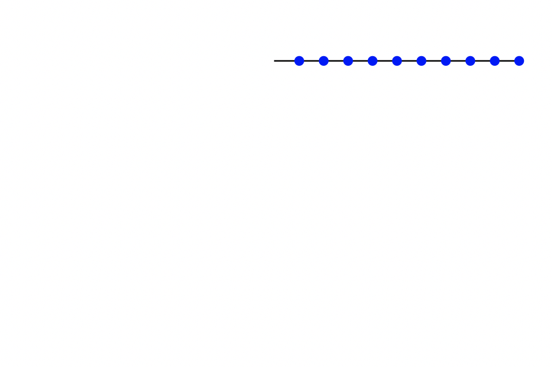
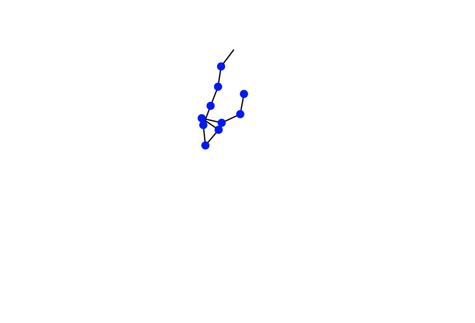

# multiple-pendulums
Mathematica code to simulate the behavior of multiple pendulums.

rigid.nb:   code to simulate the dynamics of multiple, "regular" pendulums

elastic.nb: code to simulate the dynamics of multiple pendulums on springs

